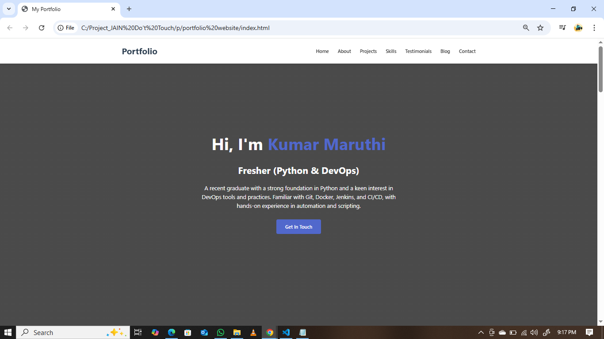
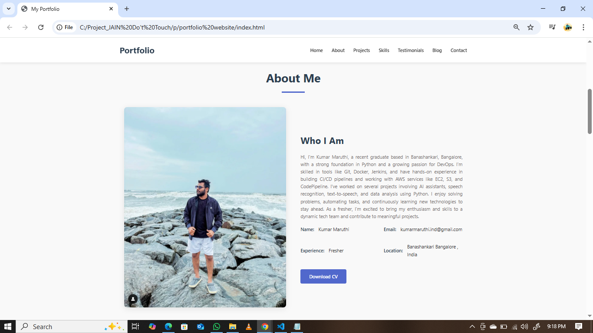
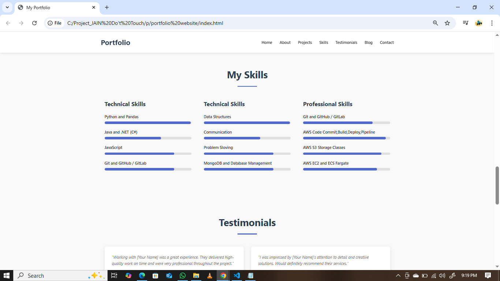
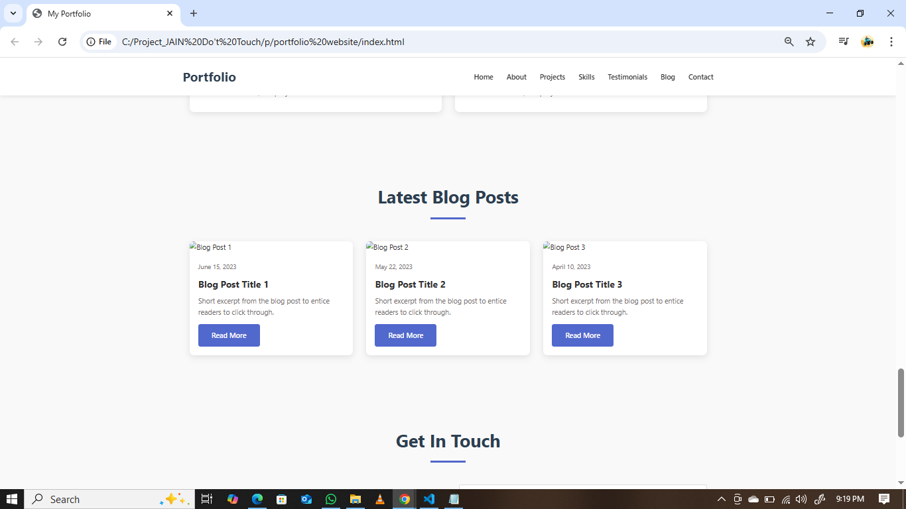
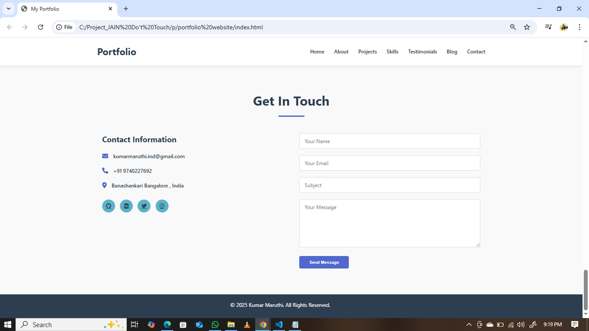

# Web-Developer-Designer

--

🌟 How to Install VS Code and Essential Extensions for HTML, CSS, and JavaScript

---

✅ Step 1: Download and Install VS Code

1. Go to the official website: [https://code.visualstudio.com](https://code.visualstudio.com)
2. Click on the Download button for your operating system:
   - Windows
   - macOS
   - Linux
3. Once the download is complete:
   - Windows: Run the `.exe` file and follow the installation steps.
   - macOS: Open the `.zip` file and drag `Visual Studio Code` into your `Applications` folder.
   - Linux: Follow the instructions provided [here](https://code.visualstudio.com/docs/setup/linux).

---

✅ Step 2: Launch VS Code

1. Open **Visual Studio Code**.
2. You’ll see a **Welcome screen** – from here, you can customize your setup or jump straight into coding.

---

✅ Step 3: Install Essential Extensions

##  How to Install an Extension:

1. Click the **Extensions icon** on the sidebar (or press `Ctrl+Shift+X` / `Cmd+Shift+X`).
2. Use the **search bar** to find the extension.
3. Click **Install**.

---

📦 Recommended Extensions for HTML, CSS, JavaScript:

| Extension Name                 | Description                                                    |
|-------------------------------|----------------------------------------------------------------|
| 🔹 Live Server**            | Launch a local development server with live reload feature.    |
| 🔹 Prettier**               | Code formatter to keep your code neat and consistent.          |
| 🔹 HTML CSS Support**       | Auto-completion for CSS class names in HTML files.             |
| 🔹 CSS Peek**               | Peek into CSS ID & class definitions from HTML files.           |
| 🔹 JavaScript (ES6) Snippets| Useful snippets for modern JavaScript development.          |
| 🔹 Auto Rename Tag**        | Auto rename paired HTML/XML tags.                              |
| 🔹 Path Intellisense**      | Autocompletes filenames in your project.                       |
| 🔹 Debugger for Chrome**    | Debug your JavaScript code right from VS Code using Chrome.    |

---

Step 4: Create Your First Project

1. Open a folder for your project:
   - Go to `File` > `Open Folder...` (or `Cmd/Ctrl + K + O`)
2. Create your files:
   - `index.html`
   - `style.css`
   - `script.js`
3. Right-click on `index.html` and select **"Open with Live Server"** to preview in the browser.

---

✅ Step 5: Customize Settings (Optional)

1. Open settings with `Ctrl+,` or `Cmd+,`.
2. Search for preferences like:
   - Theme
   - Font size
   - Format on save

✅ OUTPUT: 

